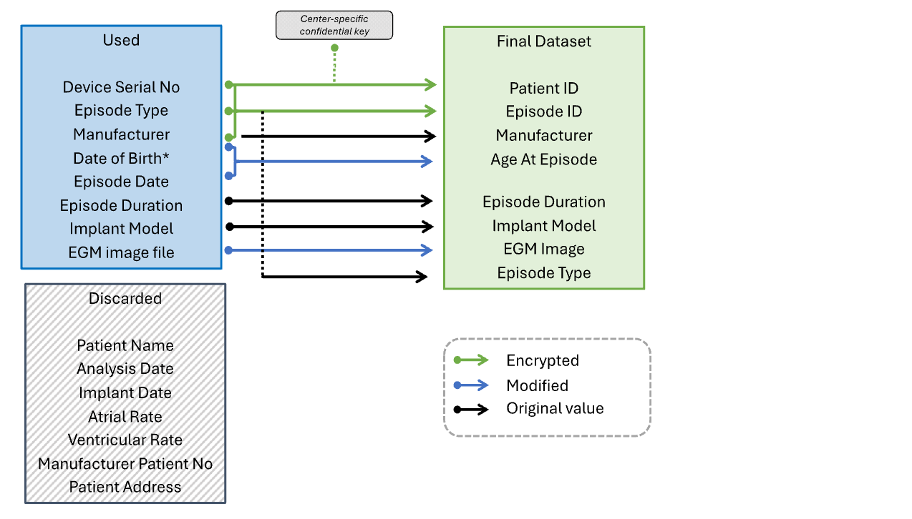
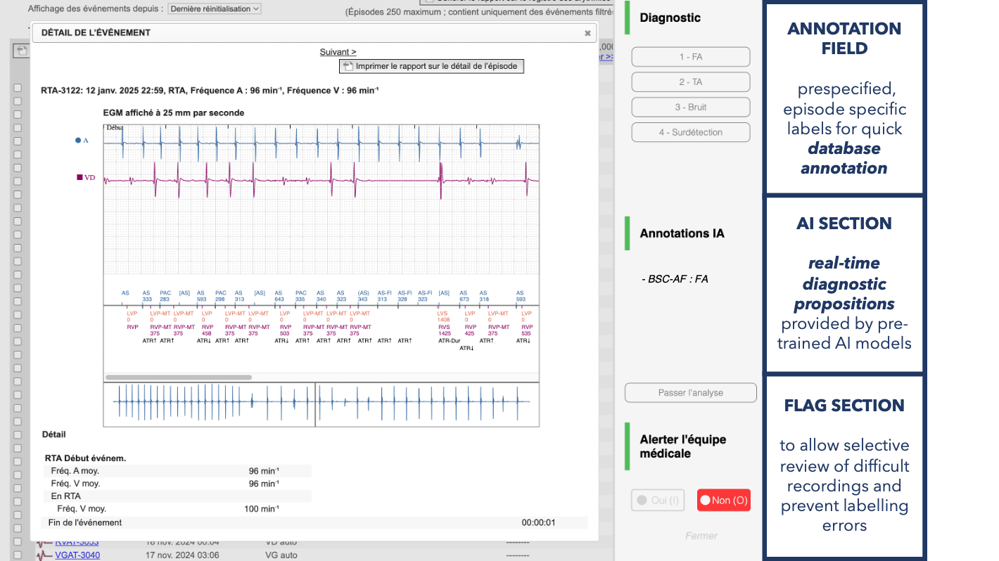

# PASTEC Chrome Extension

## Overview

The PASTEC (Platform for AI-Supported Telemonitoring in Cardiology) Chrome Extension is a medical research tool designed to extract, standardize, and annotate cardiac arrhythmia episodes from remote monitoring platforms of various implantable cardiac device manufacturers.

This extension automatically scrapes episode data from manufacturer websites, extracts electrogram (EGM) images, and enables prospective clinical annotations for research purposes.

PASTEC is primarily offered as a **joinable academic instance** operated by IHU LIRYC for multicenter collaborations.
Most participating centers **do not need to self-host** the backend: they can connect the browser plugin to the hosted instance after institutional onboarding.

Self-hosting the backend is supported for institutions that require local deployment, but it requires local IT support and security governance.

## Quick Start

### For Project Participants

The extension is available through the Chrome Web Store:

**[Install PASTEC Plugin](https://chromewebstore.google.com/detail/pastec-plugin/lkmeideppdcnbhjempijngghdpkecnlf)**

1. Click the link above
2. Click "Add to Chrome"
3. Confirm the installation when prompted
4. The PASTEC icon will appear in your browser toolbar

### For Development

1. Clone the repository
2. Install dependencies:
   ```bash
   npm install
   ```
3. Configure environment variables:
   ```bash
   cp .env.example .env
   # Edit .env with your configuration
   ```
4. Build the extension:
   ```bash
   npm run build
   ```
5. Load the extension in Chrome:
   - Navigate to `chrome://extensions/`
   - Enable "Developer mode"
   - Click "Load unpacked"
   - Select the `dist` directory

## Authentication

### Backend Authentication

The extension requires authentication with the PASTEC backend API. Authentication is handled through project-specific credentials:

- **Backend Repository**: [See backend documentation](https://github.com/LIRYC-IHU/pastec_server/blob/master/README.md)
- **Authentication Method**: OAuth2/JWT token-based authentication
- **Credentials**: Project-specific credentials are required and provided by the research coordinator

The extension automatically handles:
- Initial login and token acquisition
- Token refresh when expired
- Secure storage of authentication tokens in Chrome's local storage

You still need to login to your remote monitoring platform the usual way to access data.

### Center-Specific Pepper

To ensure data privacy and pseudonymization, each participating center uses a **unique pepper value** for hashing patient identifiers.
This pepper is provisioned to users through a **signed center configuration bundle** generated once by the backend and downloaded by the local center administrator.

Each center bundle contains:

- The center identifier
- The center-specific pepper
- Optional backend URL metadata
- A backend signature that the plugin verifies locally before importing

The backend stores only a **hash of the pepper** for later validation during uploads.
It does **not** retain the pepper in recoverable form after the initial bundle download.

Key properties:

- **Pepper Configuration**: One cryptographic secret unique to each medical center
- **Purpose**: Combined with patient identifiers to generate anonymized patient IDs and episode IDs
- **Format**: 64-character hexadecimal string
- **Provisioning**: Imported into the plugin from a signed `.json` bundle, not typed manually
- **Usage**: Applied during patient data encryption via HMAC-based hashing

The pepper ensures that:
1. Patient identifiers are not reversible
2. Different centers cannot cross-reference patient data
3. Episode tracking remains consistent within each center

### Signed Center Bundle Procedure

The signed center bundle is a **critical secret-bearing file**.
It must be treated like a local cryptographic credential for the entire center.

> Warning: the backend generates the center pepper only once and does not keep a recoverable copy. If the bundle is lost locally, the original pepper cannot be downloaded again.

#### Initial Bundle Download

1. A center administrator creates the center pepper from the backend administrative route.
2. The backend generates the pepper **once** and immediately returns a signed bundle file.
3. The administrator downloads this bundle locally and stores it in a secure institutional location.
4. The bundle is then imported into the plugin from the options page after user login.

#### Mandatory Local Backup

The bundle must be backed up locally by the center administrator immediately after download.

Recommended minimum practice:

1. Keep one primary copy in a secure institutional folder with restricted access.
2. Keep one secondary offline or restricted backup copy under institutional control.
3. Document which local admin is responsible for custody of the bundle.
4. Verify that the backup copy can actually be retrieved before distributing the bundle to users.

#### Distribution to Center Users

1. The local admin distributes the bundle **locally within the center** to authorized users only.
2. Users log in to the plugin with their own backend credentials.
3. Users then import the signed `.json` bundle into the plugin options page.
4. The plugin verifies the signature locally before storing the center configuration.
5. Users must not edit, rename, or regenerate the pepper contents manually.

#### Critical Warning

The center bundle must **never be lost**.

Because the backend does not retain the pepper in recoverable form:

1. Losing the only usable bundle means losing the center pepper.
2. Without that pepper, the center cannot continue pseudonymizing new data consistently.
3. The original pepper cannot be re-downloaded from the platform.
4. Regenerating a new pepper would break pseudonymization continuity for that center dataset.

In practice, loss of the bundle is a serious operational event and may fragment the center's dataset.
This is why secure local backup and controlled local distribution are mandatory.

## Supported Manufacturers

The extension supports five major cardiac device manufacturers (Medtronic, Boston Scientific, Abbott, Microport, Biotronik)

## Data Structure

All episode data is standardized into a common format before transmission to the backend:

```javascript
{
  // Encrypted identifiers (using center-specific pepper)
  patientId: "hashed_patient_identifier",
  episodeId: "hashed_episode_identifier",
  
  // Clinical metadata
  manufacturer: "Medtronic|Biotronik|Boston|Abbott|Microport",
  implantModel: "Device model name",
  episodeType: "Arrhythmia classification",
  episodeDuration: 123, // in seconds
  ageAtEpisode: 23375 // calculated age in seconds, keeps chronology between episodes and ensures proper pseudonymization
  
  // System reference
  system: "Manufacturer name",
  
  // Annotations
  diagnosis (Optional): "Clinician-provided diagnosis label",
  annotated: true/false
}
```

All data is pseudonymized on the client side before upload, see below data collection and treatment



## Usage Workflow

## Example Deployment Scenario

A typical deployment of the PASTEC Chrome extension in a hospital or academic setting involves the following steps:

1. Deploy the PASTEC backend on an institutional server  
   (see https://github.com/LIRYC-IHU/pastec_server),  
   or join the academic instance hosted at https://pastec.ihu-liryc.fr.

2. Define and securely store a center-specific cryptographic pepper used for client-side pseudonymization.
   This is now done through a signed center bundle generated once and kept under local administrative control.

3. Deploy the Chrome extension either via the Chrome Web Store or through an internal institutional distribution process.

4. Configure the extension to connect to the appropriate backend API endpoint  
   (local institutional deployment or https://pastec.ihu-liryc.fr).

5. Use the extension during routine remote monitoring activity to annotate and process eligible transmissions.

### Extension in Action



TLDR: AI annotation is for demonstration purposes only and needs to be evaluated within a predefined protocol.

### Typical Workflow

1. **Navigate** to a supported remote monitoring platform
2. **Log in** to the manufacturer's website
3. **Open** an episode with electrogram data
4. The extension **automatically detects** the episode
5. Display of the **contextual diagnostic options**
6. **Select** the appropriate diagnostic label from available options
7. The data is **encrypted** with the center-specific pepper
8. Episode metadata and images are **uploaded** to the backend
9. Optional: **AI analysis** jobs are queued and results displayed
10. Move to the next episode

### Batch Processing

For manufacturers supporting batch operations (Biotronik, Boston Scientific):
1. Confirm batch processing when prompted
2. The extension iterates through all available episodes
3. Each episode is presented sequentially for annotation


If unchecked, the navigation is the same as without the plugin, and the overlay pops up whenever an episode is opened.

## Technical Architecture

### Core Components

- **Content Scripts**: Injected into manufacturer websites to retrieve data
- **Background Service**: Handles authentication, encryption, and API communication
- **Overlay Interface**: Provides annotation UI and episode viewer
- **PDF Processing**: PDF.js integration for EGM image extraction (for Medtronic, Abbott and Microport)
- **Encryption Module**: HMAC-based pseudonymization using center pepper (secret key)

### Data Flow

```
Manufacturer Website
    ↓ 
Content Script
    ↓ (overlay with scraping)
    ↓ (encryption with pepper)
Background Service
    ↓ (authenticated API calls)
PASTEC Backend API
    ↓ (storage)
PostgreSQL Database + S3/File Storage
```

### Security Features

- **Zero patient data** stored in browser
- **HMAC-SHA256** hashing of patient identifiers
- **Center-specific pepper** prevents cross-center identification
- **TLS encryption** for all API communications
- **Token-based authentication** with automatic refresh
- **No reversible** patient information in stored records

## Development

### Build Commands

```bash
# Development build with hot reload
npm run dev

# Production build (minified)
npm run build
```

### Project Structure

```
chrome_ext/
├── src/
│   ├── abbott_scraping.js      # Abbott Merlin.net scraper
│   ├── biotronik_scraping.js   # Biotronik Home Monitoring scraper
│   ├── boston_scraping.js      # Boston Scientific LATITUDE scraper
│   ├── medtronic_scraping.js   # Medtronic CareLink scraper
│   ├── microport_scraping.js   # Microport scraper
│   ├── auth.js                 # Authentication handler
│   ├── background.js           # Service worker
│   ├── content.js              # Shared content script utilities
│   ├── data_formatting.js      # Data transformation utilities
│   └── intercept-fetch.js      # Network request interception
├── public/
│   ├── manifest.json           # Extension manifest (v3)
│   ├── html/                   # UI templates
│   ├── css/                    # Stylesheets
│   └── icons/                  # Extension icons
├── webpack.config.js
├── webpack.dev.js
├── webpack.prod.js
└── package.json
```

### Environment Variables

The extension uses environment variables for secure configuration. See [SECURITY.md](./SECURITY.md) for details.

**Required Variables:**
```bash
API_URL=https://pastec.ihu-liryc.fr  # Backend API endpoint, or your own for a local deployment
```

## API Integration

### Key Endpoints 

- `POST /auth/login` - User authentication
- `GET /episode/diagnoses_labels/{manufacturer}` - Retrieve diagnosis options
- `POST /episode/upload_episode` - Upload episode metadata
- `POST /episode/{episode_id}/egm` - Upload EGM images
- `PUT /episode/{episode_id}/annotation` - Submit diagnosis annotation
- `GET /ai/jobs?job_id={id}` - Check AI analysis status

See https://github.com/LIRYC-IHU/pastec_server for full API documentation

## License

See [LICENSE.md] for licensing information.

## Acknowledgments

This extension is part of a multi-center cardiac arrhythmia research initiative. Data collected supports AI model development and clinical decision support systems for cardiac device management.

## Intended Use

This extension is designed for academic research settings and requires:
- Institutional authorization
- Access to supported remote monitoring platforms
- Backend deployment of the PASTEC server (see https://github.com/LIRYC-IHU/pastec_server) or integration to the existing PASTEC instance running at IHU LIRYC with adequate authorizations

It is not intended for standalone clinical use.

## Limitations

- Dependent on manufacturer UI structure
- Requires manual configuration per center
- Not a medical device
- AI outputs are for research purposes only, and will require specific interventional protocols for further evaluation

## Governance and Maintenance

PASTEC is maintained in an academic setting.
The project currently relies on a core technical lead.
Sustainability plans include securing dedicated engineering support and expanding multicenter collaboration.

---

**Version**: 1.0.3  
**Last Updated**: February 2026  
**Supported Browsers**: Chrome 88+, Edge 88+
